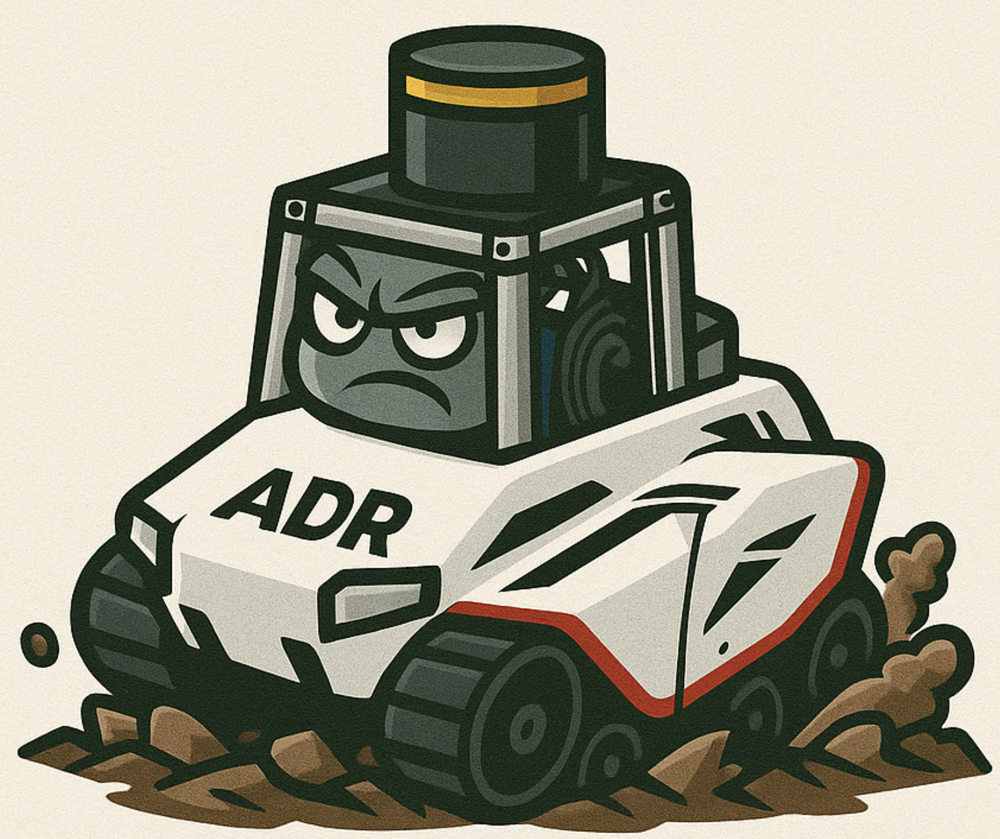

<h1 align="center">
  
  ADR Offroad Dataset
</h1>

---

## 📖 Overview
The **ADR Offroad Dataset Post-Processing Tool** is designed to handle multi-sensor off-road driving data.  
It provides functionalities for **camera–LiDAR synchronization, GNSS alignment, manual frame selection, and export of scene clips** with consistent calibration and metadata.

---

## 🚀 How to Use

1. **Setup environment**
   ```bash
   bash setup_offroad_label.sh
   conda activate offroad_label

2. **Configure parametgers**
  Update paths and default settings inside viewer.py.

3. **Run viewer**
   ```bash
   python tools/viewer.py

4. **Camera-LiDAR synchronization**
  Reload previous sync: click Resume from camera JSON
  Start new sync: proceed without reloading

5. **Navigation controls**
  Navigate frames globally or individually
  Adjust step size and LiDAR point size interactively

6. **GNSS alignment**
  Load GNSS postprocessing JSON
  Green bar = GNSS
  Orange bar = Camera
  Red bar = Intersection region (to be exported)

7. **Merge**
  Press Make merged JSON → generates merged sync file (intersection regions only)

8. **Export**
  Press Export Scenes and select the merged JSON
  Progress bar shows overall export status (based on LiDAR frames)


## Clips Directory example
```text
<data_root>/
├── test0804_11_11/                   # original capture (raw)
│   └── ...                           # (omitted)
└── <Location>_0804_11_11_scenes/     # exported scenes from the original capture
    ├── <Location>_0804_11_11_scenes_1/
    │   ├── camera_info/              # calibration matrices
    │   ├── decoded_rgb/              # RGB images
    │   │   ├── camera_1/
    │   │   ├── camera_2/
    │   │   ├── camera_3/
    │   │   ├── camera_4/
    │   │   ├── camera_5/
    │   │   └── camera_6/
    │   ├── GPS/
    │   │   └── odom_data_synced.csv               # sliced to LiDAR [start,end], index re-numbered from 0
    │   ├── imu/
    │   │   └── imu.csv               # sliced to LiDAR [start,end], index re-numbered from 0
    │   ├── lidar/                    # raw LiDAR (1:1 matched by sec_nsec)
    │   ├── lidar_xyzi/               # point clouds (x y z intensity)
    │   ├── marks_json/               # marks used for sync/export
    │   ├── radar1/                   # sliced to LiDAR [start,end]
    │   ├── radar2/
    │   ├── radar3/
    │   ├── tf_static/
    │   │   └── tf_static.json        # base_link TFs
    │   └── scene_meta.json
    ├── <Location>_0804_11_11_scenes_2/
    ├── <Location>_0804_11_11_scenes_3/
    └── <Location>_0804_11_11_scenes_4/